# Blog App

## Overview

This is a blog application built using the MERN stack, with a focus on creating a dynamic and interactive platform for writing and reading blog posts.

## Table of Contents

- [Designing Phase](#designing-phase)
- [Planning Phase](#planning-phase)
- [Coding Phase](#coding-phase)
- [Testing Phase](#testing-phase)
- [Deployment Phase](#Deployment-phase)

## Designing Phase

During the designing phase, we focused on the overall user experience and interface of the blog app. 

**Design Mockups**

- **Home Page Design**
  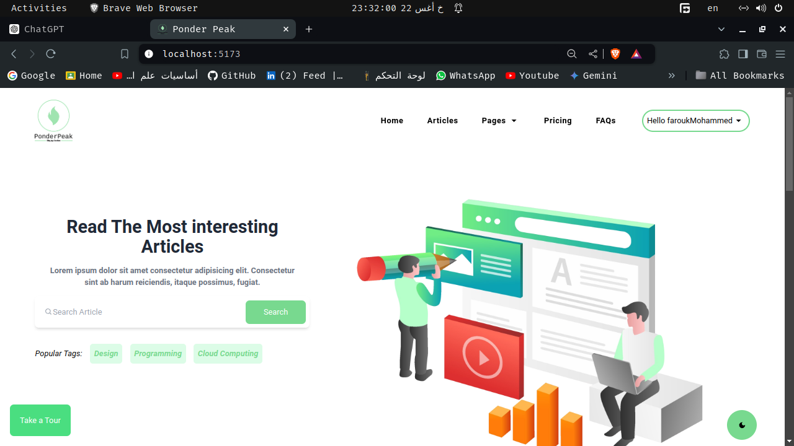

- **Post Page Design**
  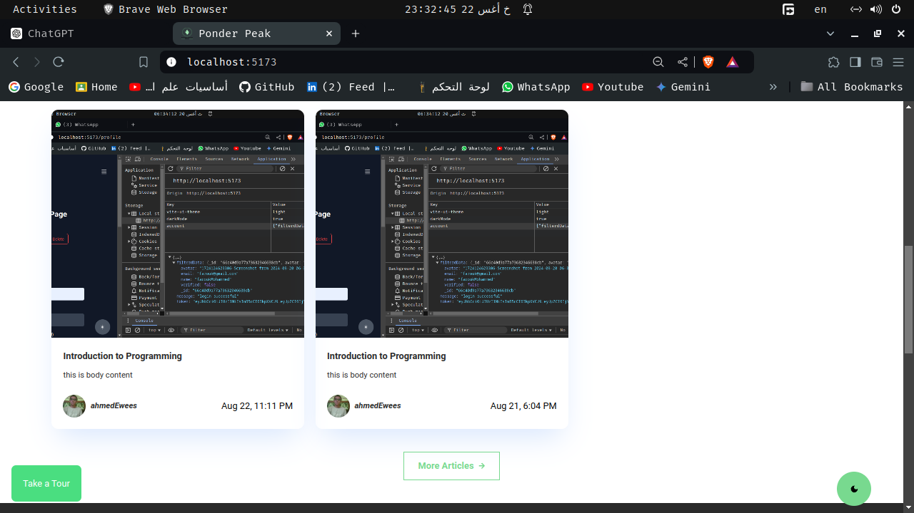

- **single post page**
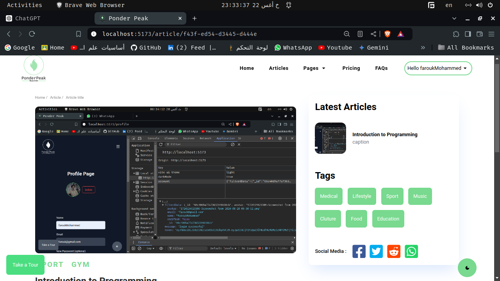

- **Login Page**
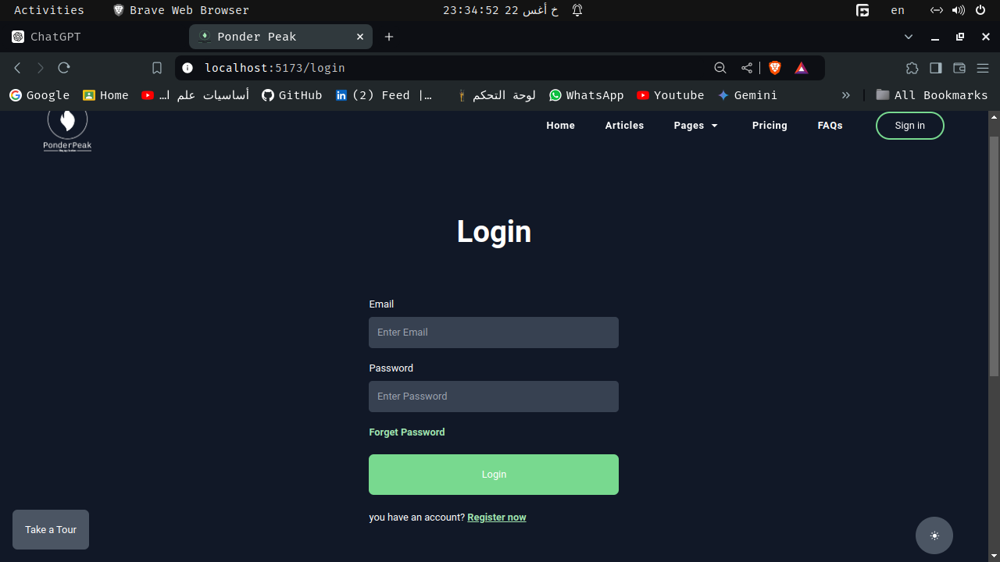

- **Register Page**
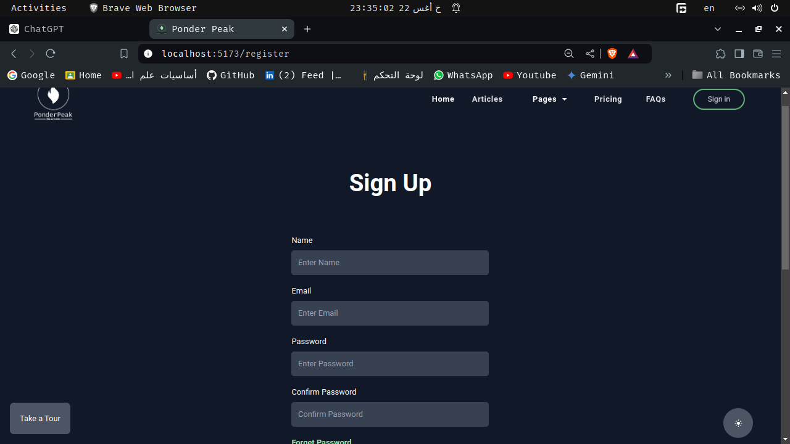

- **Profile Page**
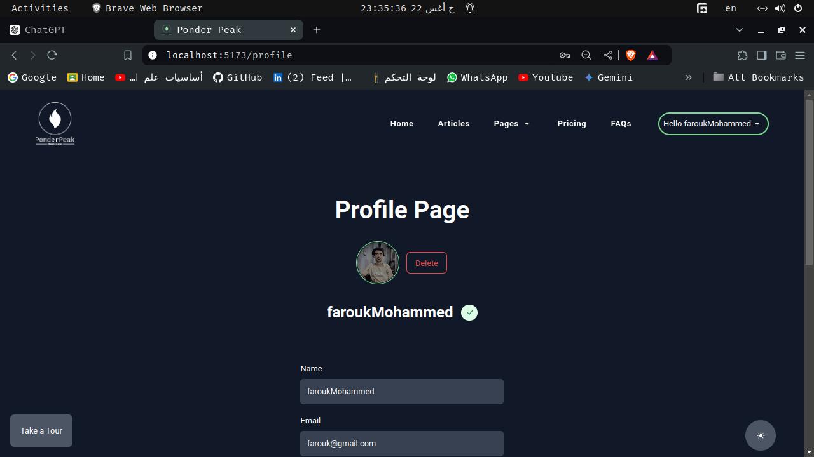


**Design Tools Used:**

- Figma for UI/UX design
- Adobe XD for interactive prototypes
- Dark Mode Support
- **dark mode **
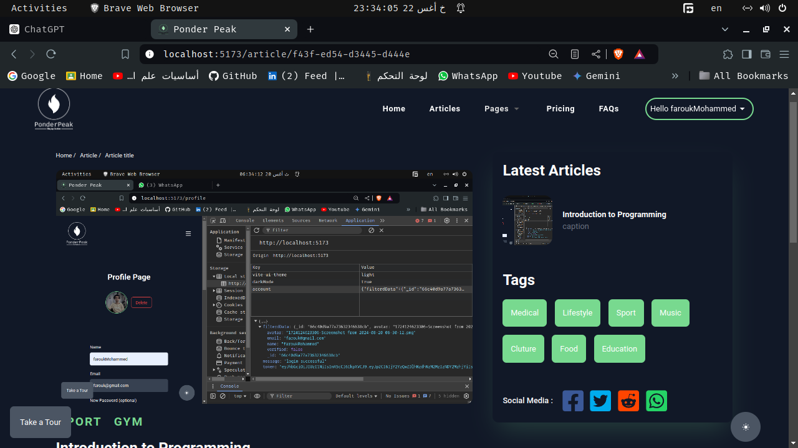

- **Light Mode**
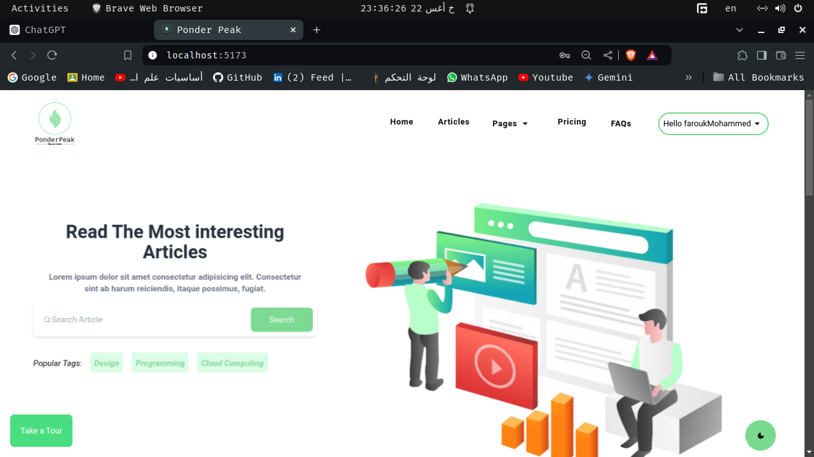

- **Responsive Design**
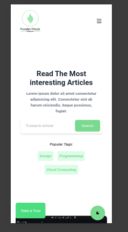


## Planning Phase

In the planning phase, we outlined the architecture and features of the blog app.

**Project Architecture**

- **Front-end:** React, Tailwind CSS
- **Back-end:** Node.js, Express
- **Database:** MongoDB

**Features to Implement:**

- User Authentication (Register, Login, Logout)
- Create, Read, Update, Delete (CRUD) for Blog Posts
- Commenting System
- Search and Filter Posts

**Technical Specifications:**

- REST API for server-client communication
- Responsive design for mobile and desktop views

## Coding Phase

The coding phase involved implementing the design and functionality as planned.

**Front-end Implementation**

- **React Components:**
  - HomePage
  - PostPage
  - Auth components (Login, Register)

- **Styling:**
  - Tailwind CSS for utility-first styling

**Back-end Implementation**

- **Express Routes:**
  - `/api/posts` - For CRUD operations on posts
  - `/api/users` - For user authentication

- **Database Models:**
  - Post Model
  - User Model

**Code Examples:**

- **React Component Example:**
  ```jsx
  import React from 'react';

  const Post = ({ title, content }) => (
    <div className="post">
      <h1>{title}</h1>
      <p>{content}</p>
    </div>
  );

  export default Post;


## Testing Phase

Testing ensured that the blog app functions as expected and is free of major bugs. We used Postman to test the API endpoints.

**API Testing with Postman**

In this phase, we performed various tests on the API endpoints to verify their functionality and correctness. Below are some examples of how we tested different routes using Postman.

### Endpoints Tested

1. **Get All Posts**

   - **Request Type:** GET
   - **Endpoint:** `/api/posts`
   - **Description:** Retrieves a list of all blog posts.
   - **Postman Request:**
    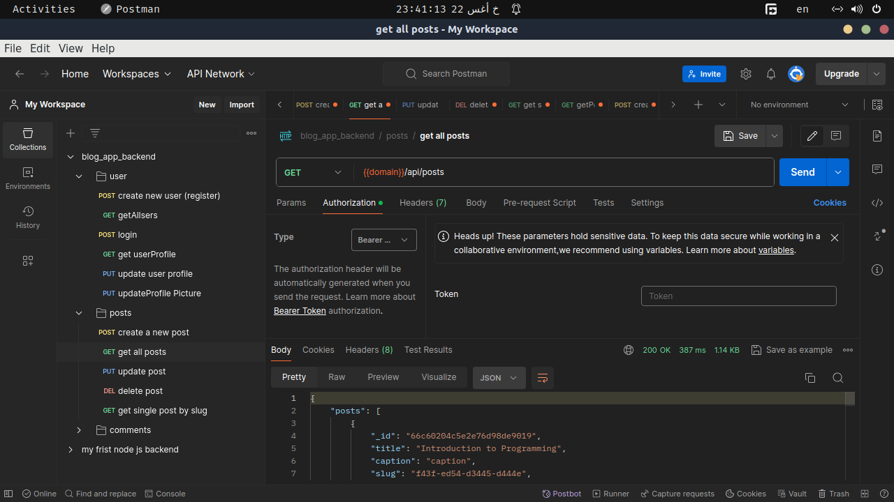 
   - **Expected Response:**
     ```json
     [
       {
         "id": "1",
         "title": "First Post",
         "content": "This is the content of the first post."
       },
       {
         "id": "2",
         "title": "Second Post",
         "content": "This is the content of the second post."
       }
     ]
     ```

2. **Create a New Post**

   - **Request Type:** POST
   - **Endpoint:** `/api/posts`
   - **Description:** Creates a new blog post.
   - **Postman Request:**
     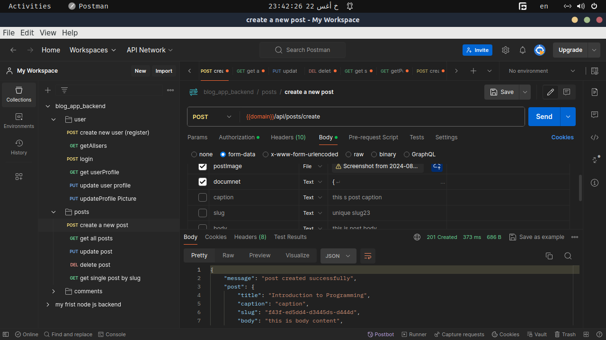
   - **Request Body:**
     ```json
     {
       "title": "New Post",
       "content": "This is the content of the new post."
     }
     ```
   - **Expected Response:**
     ```json
     {
       "id": "3",
       "title": "New Post",
       "content": "This is the content of the new post."
     }
     ```

3. **Update a Post**

   - **Request Type:** PUT
   - **Endpoint:** `/api/posts/:id`
   - **Description:** Updates an existing blog post by ID.
   - **Postman Request:**
     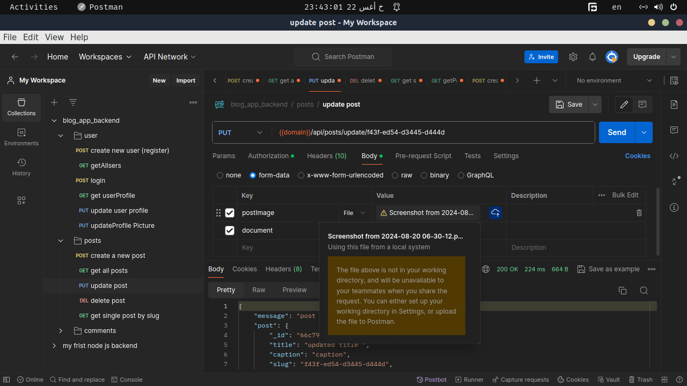
   - **Request Body:**
     ```json
     {
       "title": "Updated Post Title",
       "content": "Updated content of the post."
     }
     ```
   - **Expected Response:**
     ```json
     {
       "id": "1",
       "title": "Updated Post Title",
       "content": "Updated content of the post."
     }
     ```

4. **Delete a Post**

   - **Request Type:** DELETE
   - **Endpoint:** `/api/posts/:id`
   - **Description:** Deletes a blog post by ID.
   - **Postman Request:**
     
   - **Expected Response:**
     ```json
     {
       "message": "Post deleted successfully."
     }
For convenience, you can import the Postman collection that contains all the API endpoints for testing. [Download Postman Collection](path/to/postman-collection.json)
     ```

### Postman Collection
 

**Testing Results:**

- **Successful Responses:**
  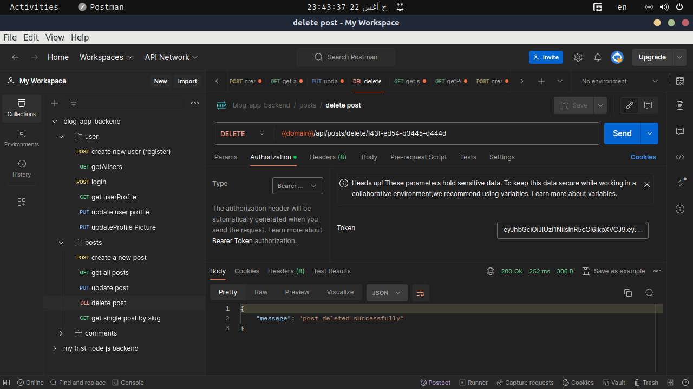

- **Error Responses:**
  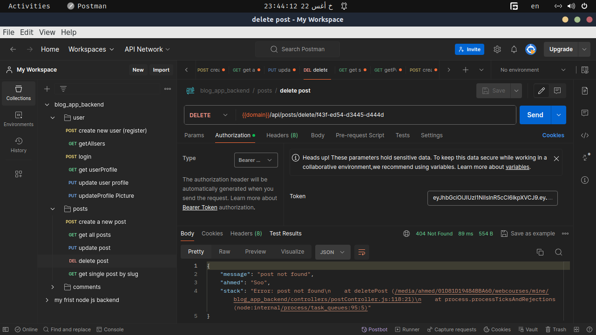

By following these steps and using the provided Postman collection, you can effectively test the blog app's API endpoints to ensure they perform as expected.


## Deployment Phase of My Blog App

### Project Overview

I recently completed the deployment of my **Blog App**. This project consists of a **front-end** built with React and styled using **TailwindCSS**, which can be accessed [here](https://blog-app-frontend-black.vercel.app/).

### Deployment Process

#### Front-End Deployment: Vercel

1. **Hosting Service**: I used [Vercel](https://vercel.com/) for deploying the front-end of my blog app. Vercel provides seamless integration with GitHub repositories, making it an ideal platform for deploying React apps.
   
2. **Steps to Deploy**:
   - First, I pushed the latest version of the code to my **GitHub** repository.
   - Connected the repository to **Vercel**.
   - Vercel automatically detected the **React.js** framework and provided default settings for building and deploying the app.
   - I configured environment variables in Vercel if needed.
   - After deployment, the app was live on [https://blog-app-frontend-black.vercel.app/](https://blog-app-frontend-black.vercel.app/).

3. **Advantages of Vercel**:
   - Automatic builds and previews for every push to the GitHub repository.
   - Fast and global CDN which ensures my app loads quickly from any location.
   - Integrated SSL for secure HTTPS access.

### Conclusion

The deployment process was smooth thanks to Vercel’s automation and easy-to-use interface. My blog app is now live and ready to be explored! Check it out [here](https://blog-app-frontend-black.vercel.app/).


